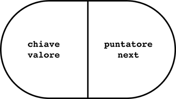
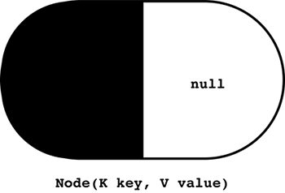
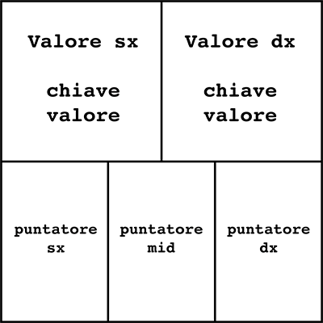

# MOVIDA

 Relazione del progetto di "Algoritmi e strutture di Dati" 2019/2020.

## 1. Progetto Sviluppato
**MOVIDA (MOVIes Data and Algorithms) è un'applicazione Java per interagire con una knowledge-base a tema cinema**

Il progetto consiste nella realizzazione di un modulo software pensato per essere integrato in un'applicazione più complessa. MOVIDA permette di:

* importare una knowledge-base
* visualizzare informazioni su film e attori
* cercare informazioni in base a criteri diversi

La classe `MovidaCore` implementa alcune interfacce, che descrivono gruppi di operazioni:

* `IMovidaDB`: caricamento in memoria e lettura dei dati
* `IMovidaConfig`: scelta degli algoritmi e strutture dati da usare
* `IMovidaSearch`: ricerca delle informazioni
* `IMovidaCollaborations`:
  *  Identificare i collaboratori diretti di un attore
  *  Ricostruire il team di un attore
  *  Identificare l'insieme di collaborazioni caratteristiche del team di un attore, che massimizza lo score complessivo

 Un'istanza della classe `MovidaCore` permette di caricare e successivamente recuperare le informazioni relative a film, attori e registi.


## 2. Specifiche di implementazione

Implementazioni dizionario:
* ListaCollegataNonOrdinata
* Alberi23

Algoritmi di ordinamento:
* BubbleSort
* QuickSort

## 3. MovidaDictionary

* `void put(K key, V value)`: inserimento del nodo all'interno del dizionario, il nodo è caratterizzata da una chiave e un valore
* `V get(K key)`: ricerca di un valore all'interno del dizionario dato in input una chiave
* `void remove(K key)`: rimuove un elemento dal dizionario data in input una chiave
* `LinkedList<V> values()`: trasforma il dizionario in una LinkedList<V> con all'interno solo i valori del nodo
* `int size()`: determina il numero di nodi presenti nel dizionario
* `int dSize()`: decrementa di uno il numero di nodi presenti nel dizionario
* `Set<K> keySet()`: crea un set di chiavi contenute nel dizionario
* `boolean containsKey(K key)`: ritorna true se nel dizionario è presente la chiave

### 3.1 ListaCollegataNonOrdinata

La ListaCollegataNonOrdinata consiste in una catena di strutture chiamate nodi. Ogni nodo contiene una chiave, un valore e un puntatore al prossimo nodo della catena. L’ultimo nodo contiene il puntatore nullo.

La struttura del nostro **Nodo** è la seguente:

```
private class Node<K,V> {
    K key;
    V value;

    Node<K,V> next;

    private Node(K key, V value) {
        this.key = key;
        this.value = value;
        this.next = null;
    }
```  
 

### 3.2 Alberi23

Un 2-3 tree è un albero che soddisfa le seguenti proprietà:
* ogni nodo contiene una o due chiavi
* ogni nodo interno ha due figli (se contiene una chiave) oppure tre figli (se contiene due chiavi)
* tutte le foglie sono allo stesso livello

La struttura del nostro **Nodo** è la seguente:
```
private class Node<K,V> {
    //Elemento di sinistra
    K keyLeft;
    V valueLeft;

    //Elemento di destra
    K keyRight;
    V valueRight;

    //Puntatori ai figli
    Node<K,V> left;
    Node<K,V> mid;
    Node<K,V> right;
```
Per comodità parte del codice è stato omesso.

Ogni nodo contiene al massimo 2 elementi e minimo 1. Nel caso in cui c'è un solo elemento sarà sempre a sinistra, in quel caso la destra è null.
La struttura degli alberi 2-3 definisce due tipi di nodi/figli:
* Nodo 2: Questo nodo ha solo due figli, sempre a sinistra e al centro. L'elemento di destra è null e anche il figlio destro è null.
* Nodo 3: Questo nodo ha due elementi, quindi ha 3 figli: sinistro, centrale e destro. Quindi è pieno.

 

Ogni Nodo possiede quattro costruttori differenti:
* `Node()`: che crea un nodo con tutti i campi vuoti
* `Node(K key, V value)`: crea un nodo con l’elemento di sinistra
* `Node(Node leftElement, Node rightElement)`: crea un nodo con gli elementi a sinistra e a destra
* `Node(Node leftElement, Node rightElement, Node left, Node mid)`: crea un nodo con due elementi e due figli: il sinistro e il destro

## 4. MovidaSort

`MovidaSort` è un interfaccia che successivamente viene implementata in BubbleSort e QuickSort. Qui troviamo solo la funzione `MovidaSort` che prende in input un MovidaDictionary e lo restituisce ordinato.

### 4.1 BubbleSort

Bubble Sort è l'algoritmo di ordinamento più semplice che funziona scambiando ripetutamente gli elementi adiacenti se sono nell'ordine sbagliato.

Nell'algoritmo Bubble Sort, l'array viene attraversato dal primo elemento all'ultimo elemento. Qui, l'elemento corrente viene confrontato con l'elemento successivo. Se l'elemento corrente è maggiore dell'elemento successivo, viene scambiato.

### 4.2 QuickSort

Quicksort è un algoritmo di ordinamento, che sfrutta il principio divide et impera. La lista di input è divisa in due da un elemento centrale chiamato pivot: uno con gli elementi minori del pivot e l'altro con elementi maggiori del pivot.

* Scegliamo un elemento dalla lista, chiamato pivot. Lo useremo per dividere la lista in due.
* Riordiniamo tutti gli elementi attorno al pivot: quelli con un valore inferiore vengono posizionati prima di esso e tutti gli elementi maggiori del pivot dopo di esso. Dopo questo passaggio, il pivot è nella sua posizione finale.
* Applichiamo i passaggi precedenti in modo ricorsivo a entrambe le sotto-liste: a sinistra e a destra del pivot.
